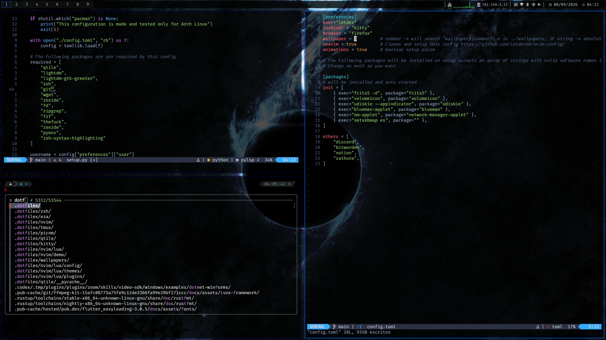
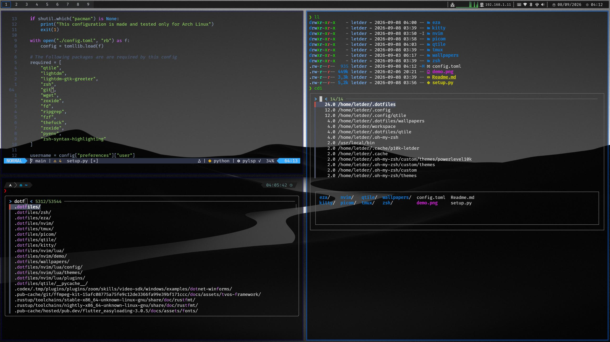

# Dotfiles

My personal Arch Linux dotfiles and setup scripts.

This repository contains the configuration files and automation I use to reproduce my development environment, including Qtile, Neovim, terminal utilities, desktop applications, theming, and other system preferences.
## Features

* Automated Arch Linux setup
* Symlink-based configuration deployment
* Qtile configuration
* Configurable terminal, browser, wallpaper, and Nerd Font
* Optional Neovim setup
* Optional `eza` configuration and theme
* Optional Picom animations
* Automatic installation of selected packages
* Automatic startup configuration for desktop utilities

## Installation

### 1. Clone the repository

```bash
git clone https://github.com/Letder40/dotfiles.git
cd dotfiles
```

### 2. Configure your setup

Edit `config.toml` and adjust the preferences and software lists to match your system.

### 3. Run the installer

```bash
sudo python setup.py
```

The setup script will install the configured packages and create symlinks for the configuration directories contained in this repository.

> Review `config.toml` and the setup script before running it as root, specially make sure to change the defined `user` to match yours.

## Configuration

Most installation and desktop preferences are controlled through `config.toml`.

```toml
[preferences]
user="letder"
terminal = "kitty"
browser = "firefox"
wallpaper = 0         # number -> will search ^wallpaper${number}\.* in ../wallpapers; if string -> absolute path to wallpaper image
neovim = true         # Clones and setup this config https://github.com/Letder40/nvim-config/
animations = true     # boolean setup picom

# The following packages will be installed on setup accepts an array of strings with valid software names instalable with pacman
# Change as much as you want

[packages]
# will be installed and auto started
init = [
    { exec="fcitx5 -d", package="fcitx5" }
    { exec="volumeicon", package="volumeicon" }
    { exec="udiskie --appindicator", package="udiskie" }
    { exec="blueman", package="blueman" }
    { exec="nm-applet", package="network-manager-applet" }
    { exec="setxkbmap es", package="" }
]

others = [
    "discord",
    "bitwarden",
    "notion",
    "zathura",
] 
```

### Preferences

The `[preferences]` section controls settings consumed by the setup scripts and Qtile configuration.

You can configure:

* User
* Terminal
* Browser
* Wallpaper
* Nerd Font
* Neovim installation
* `eza` configuration
* Picom animations

### Software

The `[packages]` section defines packages that should be installed with `pacman`.

The package lists are separated by purpose for readability:

* `init` —  software that start automatically with the graphical session 
* `others` — additional desktop applications

You can freely add or remove packages as long as their names are valid Arch Linux package names.

## Customization

The automated setup is only the starting point.

For more advanced customization, edit the individual configuration files directly. Most components can be modified independently without changing the installation process.

My Neovim configuration is maintained separately:

[Letder40/nvim-config](https://github.com/Letder40/nvim-config)

## Demo




