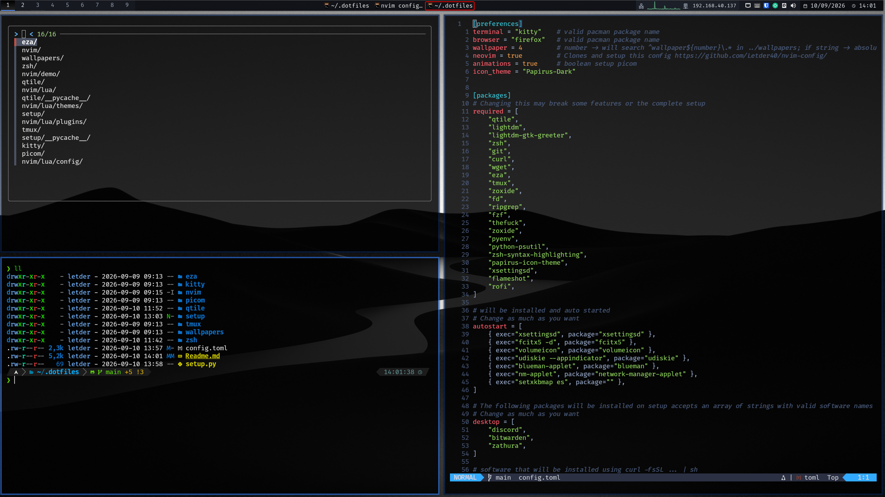

# Dotfiles

My personal Arch Linux desktop configuration and installer. It sets up a Qtile-based environment, installs the configured software, and links the repository's configuration files into the current user's home directory.

## Features

- Qtile configuration with multi-screen support, keybindings, autostart applications, and theming
- Package installation through `pacman`
- Configurable terminal, browser, wallpaper, and desktop applications
- Optional Picom animations and Neovim configuration
- Declarative installers for shell scripts and Git repositories
- Symlink-based deployment with automatic backups of existing files
- Zsh, Powerlevel10k, Kitty, Tmux, `eza`, and desktop utility configuration

## Requirements

- Arch Linux
- Python 3.11 or newer
- `sudo`
- An internet connection for packages, scripts, and Git repositories

The installer must be run as your regular user. It validates your `sudo` credentials at startup and elevates only the `pacman` commands used to install packages.

## Installation

1. Clone the repository:

   ```bash
   git clone https://github.com/Letder40/dotfiles.git
   cd dotfiles
   ```

2. Review and edit `config.toml`. In particular, check the package lists and every URL under `[[curl]]` before running downloaded scripts.

3. Run the installer without `sudo`:

   ```bash
   python setup.py
   ```

The installer will:

- install missing packages;
- run configured remote installers and clone or update configured repositories;
- set the configured GTK 3/4 icon theme and publish it to running X11 applications;
- link the Qtile, `eza`, wallpaper, and Zsh configuration;
- link Kitty, Picom, and Neovim configuration when their corresponding options are enabled.

If a destination already exists, it is renamed with a timestamped `_bck` suffix before the new symlink is created. Running the installer again leaves correct symlinks and installed packages unchanged, and updates existing Git repositories with a fast-forward-only pull.

## Configuration

Most installation and desktop preferences live in `config.toml`.

### Preferences

```toml
[preferences]
terminal = "kitty"    # pacman package and command used by Qtile
browser = "firefox"   # pacman package and command used by Qtile
wallpaper = 4         # wallpaper4.png/.jpg/.jpeg from ~/media/wallpapers
neovim = true         # install Neovim and the external configuration
animations = true     # install, link, and start Picom
icon_theme = "Papirus-Dark" # GTK and system-tray icon theme
```

`wallpaper` can be either an integer matching a bundled `wallpaper<number>` file or a path to an existing image. Paths may start with `~`. If the configured image cannot be found, Qtile falls back to `wallpaper0.png`.

The installer writes the icon theme to the GTK 3 and GTK 4 settings files. Qtile starts `xsettingsd` to expose the same setting to tray applications; rerunning the installer reloads an already-running daemon, so applications can update without logging out.

### Pacman packages

```toml
[packages]
required = [
    "qtile",
    "lightdm",
    "zsh",
    "git",
    "curl",
]

autostart = [
    { exec = "volumeicon", package = "volumeicon" },
    { exec = "nm-applet", package = "network-manager-applet" },
    { exec = "setxkbmap es", package = "" },
]

desktop = [
    "discord",
    "bitwarden",
    "zathura",
]
```

- `required` contains packages needed by the environment. Installation stops if these cannot be installed; edit this list carefully.
- `autostart` pairs a command run once when Qtile starts with the package that provides it. Use an empty package string when no package needs to be installed.
- `desktop` contains additional packages installed through `pacman`.

The configured terminal and browser are also installed through `pacman`.

### Remote shell installers

Each `[[curl]]` entry downloads a script and runs it with `sh` as the current user:

```toml
[[curl]]
url = "https://example.com/install.sh"
params = "--example-option"
check_path = "~/.example"
required = false
```

- `url` is the script URL.
- `params` is an optional string of arguments passed to the script.
- `check_path` skips installation when that path already exists.
- `required = true` makes a failure stop the setup; optional failures are logged instead.

### Git repositories

Each `[[git]]` entry defines a repository to clone or update as the current user:

```toml
[[git]]
src = "https://github.com"
repo = "romkatv/powerlevel10k.git"
path = "~/.oh-my-zsh/custom/themes/powerlevel10k"
required = true
```

The clone URL is formed as `<src>/<repo>`. New clones use a depth of one; existing repositories are updated with `git pull --ff-only`. As with remote installers, `required` controls whether a failure stops the setup.

## Customization

The installer is a starting point. Individual configurations can be changed directly in their repository directories, including `qtile/`, `kitty/`, `picom/`, `tmux/`, `eza/`, and `zsh/`.

The Neovim configuration is maintained separately at [Letder40/nvim-config](https://github.com/Letder40/nvim-config) and is cloned into `nvim/` when enabled.

## Demo


