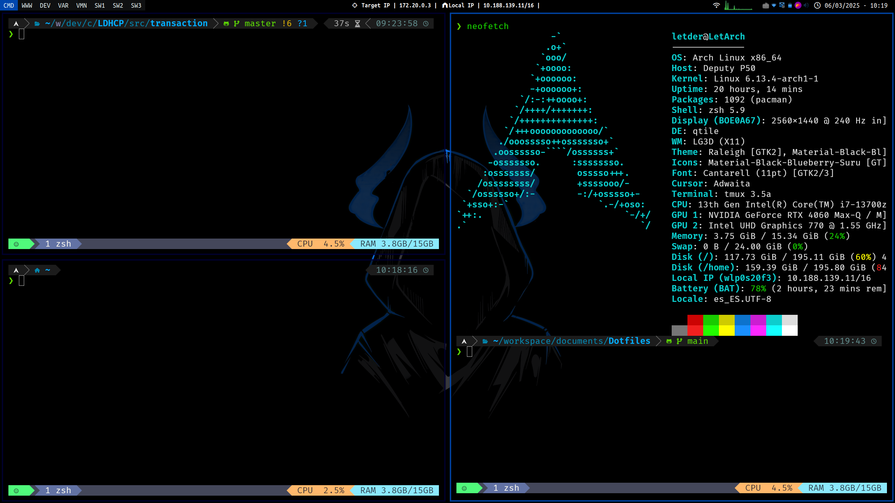

# Dotfiles

Welcome to my dotfiles repository! This repository contains configuration files for my Neovim and Qtile setups on Arch Linux, providing a personalized development environment.

## Table of Contents

- [Installation](#installation)
- [Neovim Configuration](#neovim-configuration)
- [Qtile Configuration](#qtile-configuration)
- [Usage](#usage)
- [Demo](#Demo)

## Installation

1. **Clone the repository:**  
   Run the command:  
   git clone https://github.com/Letder40/Dotfiles.git

2. **Backup your existing configuration files** if needed.

3. **Create symbolic links** from this repository to your home directory:  
   Example, for Qtile configuration, run:  
   ```bash
   ln -s ~/dotfiles/qtile/ ~/.config/qtile/
   ```

## Neovim Configuration

The Neovim settings are located in the nvim folder. This configuration includes custom settings, plugins, and key mappings designed to enhance your coding experience.

## Qtile Configuration

The Qtile configuration files are in the qtile folder. This setup provides a flexible and efficient window management system tailored for productivity.

## Usage

- **Customize:** Edit the configuration files to suit your preferences.
- **Install dependencies:** Ensure that you have all the required plugins and packages installed for Neovim and Qtile.
- **Enjoy:** Start your applications and experience a personalized workflow.

## Demo


